# DTC API SDK - Architecture

This document provides architectural overview of the Aparavi Data Toolchain API SDK with visual diagrams.

## SDK Architecture Overview

### High-Level SDK Structure


### API Communication Flow


## Pipeline Architecture

### Component-Based Pipeline Structure

```mermaid
graph LR
    subgraph "Pipeline Format"
        PipelineWrapper["{'pipeline': {...}}"]
        
        subgraph "Pipeline Content"
            Source[source: 'webhook_1']
            Components[components: [...]]
            ID[id: 'pipeline-id']
        end
        
        PipelineWrapper --> Source
        PipelineWrapper --> Components
        PipelineWrapper --> ID
    end
    
    subgraph "Component Structure"
        Comp1[Component 1<br/>webhook_1]
        Comp2[Component 2<br/>parse_1]
        Comp3[Component 3<br/>response_1]
        
        Comp1 --> |"lane: tags"| Comp2
        Comp2 --> |"lane: text"| Comp3
    end
    
    Source -.->|"references"| Comp1
    Components --> Comp1
    Components --> Comp2
    Components --> Comp3
```

### Webhook → Parse → Response Flow

```mermaid
graph TD
    subgraph "Input"
        File[📄 Input File<br/>PDF, DOC, TXT, etc.]
        WebData[🌐 Webhook Data<br/>JSON payload]
    end
    
    subgraph "Pipeline Components"
        Webhook[🪝 Webhook Component<br/>id: webhook_1<br/>provider: webhook]
        Parse[🔄 Parse Component<br/>id: parse_1<br/>provider: parse]
        Response[📤 Response Component<br/>id: response_1<br/>provider: response]
    end
    
    subgraph "Data Lanes"
        TagsLane[tags lane]
        TextLane[text lane]
        OutputLane[output lane]
    end
    
    subgraph "Output"
        ParsedText[📋 Parsed Text<br/>Extracted content]
        Metadata[📊 Metadata<br/>File info, stats]
    end
    
    File --> Webhook
    WebData --> Webhook
    
    Webhook --> |tags| TagsLane
    TagsLane --> Parse
    
    Parse --> |text| TextLane
    TextLane --> Response
    
    Response --> |output| OutputLane
    OutputLane --> ParsedText
    OutputLane --> Metadata
```



## SDK Component Relationships

### Class Hierarchy


### API Endpoint Mapping

```mermaid
graph TB
    subgraph "SDK Methods"
        GetVersion[get_version()]
        GetStatus[get_status()]
        CreatePipe[create_pipeline()]
        DeletePipe[delete_pipeline()]
        ValidatePipe[validate_pipeline()]
        UploadFiles[upload_files()]
        ExecTask[execute_task()]
        GetTaskStatus[get_task_status()]
        CancelTask[cancel_task()]
        SendWebhook[send_webhook()]
        GetServices[get_services()]
    end
    
    subgraph "API Endpoints"
        VersionEP[GET /version]
        StatusEP[GET /status]
        CreateEP[POST /pipe]
        DeleteEP[DELETE /pipe]
        ValidateEP[POST /pipe/validate]
        UploadEP[PUT /pipe/process]
        TaskEP[PUT /task]
        TaskStatusEP[GET /task]
        TaskCancelEP[DELETE /task]
        WebhookEP[PUT /webhook]
        ServicesEP[GET /services]
    end
    
    GetVersion --> VersionEP
    GetStatus --> StatusEP
    CreatePipe --> CreateEP
    DeletePipe --> DeleteEP
    ValidatePipe --> ValidateEP
    UploadFiles --> UploadEP
    ExecTask --> TaskEP
    GetTaskStatus --> TaskStatusEP
    CancelTask --> TaskCancelEP
    SendWebhook --> WebhookEP
    GetServices --> ServicesEP
```

## Data Flow Architecture

### Complete Processing Workflow

```mermaid
graph TD
    subgraph "Client Application"
        App[📱 Your Application]
        SDK[🔧 DTC SDK]
    end
    
    subgraph "DTC API Layer"
        Auth[🔐 Authentication]
        Validation[✅ Validation]
        PipelineAPI[🔄 Pipeline API]
        TaskAPI[⚙️ Task API]
    end
    
    subgraph "Processing Engine"
        Webhook[🪝 Webhook Receiver]
        Parser[📄 Parse Engine]
        AI[🤖 AI/ML Components]
        Storage[💾 Result Storage]
    end
    
    subgraph "Output Channels"
        DirectResult[📊 Direct Results]
        WebhookCallback[🔔 Webhook Callbacks]
        UIInterfaces[🖥️ UI Interfaces]
    end
    
    App --> SDK
    SDK --> Auth
    Auth --> Validation
    Validation --> PipelineAPI
    Validation --> TaskAPI
    
    PipelineAPI --> Webhook
    TaskAPI --> Parser
    
    Webhook --> Parser
    Parser --> AI
    AI --> Storage
    
    Storage --> DirectResult
    Storage --> WebhookCallback
    Storage --> UIInterfaces
    
    DirectResult --> SDK
    WebhookCallback --> App
    UIInterfaces --> App
```



### Error Handling Flow


## Deployment Architecture

### SDK Integration Patterns

```mermaid
graph TB
    subgraph "Development Environment"
        DevApp[Development App]
        DevSDK[DTC SDK]
        DevAPI[Dev API<br/>eaas-dev.aparavi.com]
    end
    
    subgraph "Production Environment"
        ProdApp[Production App]
        ProdSDK[DTC SDK]
        ProdAPI[Prod API<br/>api.aparavi.com]
    end
    
    subgraph "Integration Patterns"
        BatchJob[📦 Batch Processing]
        RealTime[⚡ Real-time Processing]
        WebApp[🌐 Web Application]
        CLI[💻 CLI Tools]
    end
    
    DevApp --> DevSDK
    DevSDK --> DevAPI
    
    ProdApp --> ProdSDK
    ProdSDK --> ProdAPI
    
    BatchJob -.-> ProdSDK
    RealTime -.-> ProdSDK
    WebApp -.-> ProdSDK
    CLI -.-> ProdSDK
```



## Configuration Architecture

### Environment-Based Configuration

```mermaid
graph LR
    subgraph "Configuration Sources"
        EnvVars[🔧 Environment Variables<br/>DTC_API_KEY<br/>DTC_BASE_URL<br/>DTC_TIMEOUT]
        ConfigFile[📄 Config Files<br/>config.json<br/>.env]
        DirectParams[⚙️ Direct Parameters<br/>DTCApiClient(api_key=...)]
    end
    
    subgraph "SDK Configuration"
        Client[DTCApiClient]
        Auth[Authentication]
        Network[Network Settings]
        Retry[Retry Policy]
    end
    
    subgraph "Pipeline Configuration"
        Source[Source Definition]
        Components[Component Array]
        Settings[Processing Settings]
    end
    
    EnvVars --> Client
    ConfigFile --> Client
    DirectParams --> Client
    
    Client --> Auth
    Client --> Network
    Client --> Retry
    
    Source --> Components
    Components --> Settings
```

---

## Summary

The DTC API SDK provides a clean, well-structured interface to the Aparavi Data Toolchain API with:

- **Robust Architecture**: Component-based design with proper error handling
- **Flexible Configuration**: Multiple ways to configure pipelines and processing
- **Complete API Coverage**: All endpoints supported with type-safe interfaces
- **Production Ready**: Built-in retry logic, authentication, and error recovery
- **Developer Friendly**: Comprehensive documentation and examples

The architecture supports both simple one-off tasks and complex multi-component pipelines for processing various data types through webhook → parse → response workflows. 