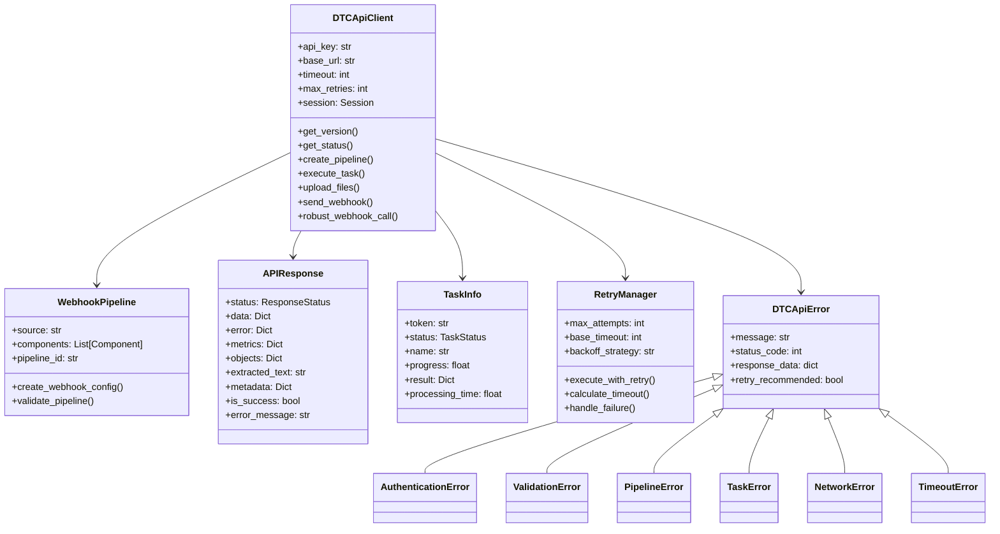

# DTC API SDK - Architecture

This document provides architectural overview of the Aparavi Data Toolchain API SDK with visual diagrams.

## SDK Architecture Overview

### High-Level SDK Structure

```mermaid
graph TB
    subgraph "DTC API SDK"
        Client[DTCApiClient]
        Models[Data Models]
        Exceptions[Exception Handling]
        Config[Configuration]
    end
    
    subgraph "Core Components"
        Client --> Auth[Authentication]
        Client --> HTTP[HTTP Client]
        Client --> Retry[Retry Logic]
        Client --> Timeout[Timeout Management]
        
        Models --> Response[APIResponse]
        Models --> Pipeline[PipelineConfig]
        Models --> Task[TaskInfo]
        Models --> Service[ServiceInfo]
        
        Exceptions --> Base[DTCApiError]
        Exceptions --> AuthErr[AuthenticationError]
        Exceptions --> Valid[ValidationError]
        Exceptions --> Net[NetworkError]
    end
    
    subgraph "API Endpoints"
        Health[Health Check]
        Pipes[Pipeline Management]
        Tasks[Task Execution]
        Files[File Operations]
        Webhooks[Webhook Integration]
        Services[Service Management]
    end
    
    Client --> Health
    Client --> Pipes
    Client --> Tasks
    Client --> Files
    Client --> Webhooks
    Client --> Services
```



### Webhook Processing Architecture (Recommended Approach)

The webhook approach is the **recommended method** for programmatic data extraction, providing direct API access to processed results without web interfaces.

```mermaid
graph TD
    subgraph "Application Layer"
        App[📱 Your Application]
        SDK[🔧 DTC SDK]
    end
    
    subgraph "Pipeline Creation"
        WebhookPipe[🪝 Webhook Pipeline<br/>webhook → parse → response]
        TaskToken[🎫 Task Token<br/>Generated ID]
    end
    
    subgraph "Data Processing"
        WebhookReceiver[📥 Webhook Receiver<br/>Accepts Base64 files]
        ParseEngine[🔄 Parse Engine<br/>Extracts text/data]
        ResponseFormatter[📤 Response Formatter<br/>Returns structured data]
    end
    
    subgraph "Retry & Timeout Management"
        RetryLogic[🔄 Automatic Retry<br/>3 attempts, progressive backoff]
        TimeoutHandler[⏱️ Timeout Management<br/>60-90 seconds for processing]
        ConnectionHandling[🔗 Connection Handling<br/>Robust error recovery]
    end
    
    subgraph "Output"
        StructuredData[📊 Structured Data<br/>JSON with extracted content]
        ExtractedText[📄 Extracted Text<br/>Readable content]
        Metadata[📋 File Metadata<br/>Size, type, encoding]
    end
    
    App --> SDK
    SDK --> WebhookPipe
    WebhookPipe --> TaskToken
    
    SDK --> |"send_webhook(token, data)"| WebhookReceiver
    WebhookReceiver --> ParseEngine
    ParseEngine --> ResponseFormatter
    
    SDK --> RetryLogic
    RetryLogic --> TimeoutHandler
    TimeoutHandler --> ConnectionHandling
    
    ResponseFormatter --> StructuredData
    StructuredData --> ExtractedText
    StructuredData --> Metadata
    
    ExtractedText --> App
    Metadata --> App
```



### Working Webhook Pipeline Configuration

```mermaid
graph LR
    subgraph "Pipeline Structure"
        PipelineWrapper["{'pipeline': {...}}"]
        
        subgraph "Required Components"
            Source[source: 'webhook_1']
            Components[components: [...]]
            ID[id: 'webhook-processor']
        end
        
        PipelineWrapper --> Source
        PipelineWrapper --> Components
        PipelineWrapper --> ID
    end
    
    subgraph "Component Chain"
        Webhook[🪝 webhook_1<br/>provider: webhook<br/>mode: Source]
        Parse[🔄 parse_1<br/>provider: parse<br/>input: tags from webhook_1]
        Response[📤 response_1<br/>provider: response<br/>input: text from parse_1]
        
        Webhook --> |"lane: tags"| Parse
        Parse --> |"lane: text"| Response
    end
    
    Source -.->|"references"| Webhook
    Components --> Webhook
    Components --> Parse
    Components --> Response
```

## Complete Webhook Workflow Implementation

### Step-by-Step Processing Flow

```mermaid
sequenceDiagram
    participant App as Application
    participant SDK as DTC SDK
    participant API as DTC API
    participant Engine as Processing Engine
    
    Note over App,Engine: Phase 1: Setup & Authentication
    App->>SDK: Initialize DTCApiClient(api_key)
    SDK->>API: Authenticate
    API-->>SDK: ✅ Authentication Success
    
    Note over App,Engine: Phase 2: Pipeline Creation
    App->>SDK: create_webhook_pipeline()
    SDK->>API: POST /pipe (webhook→parse→response)
    API-->>SDK: Task Token
    
    Note over App,Engine: Phase 3: Data Submission with Retry Logic
    App->>SDK: send_webhook(token, file_data)
    
    loop Retry Logic (max 3 attempts)
        SDK->>API: PUT /webhook?token=xxx
        alt Success
            API->>Engine: Start Processing
            Engine-->>API: Processing Complete
            API-->>SDK: ✅ Structured Results
        else Connection/Timeout Error
            SDK->>SDK: Wait (progressive backoff)
            Note over SDK: Retry attempt with longer timeout
        end
    end
    
    Note over App,Engine: Phase 4: Result Processing
    SDK->>SDK: Parse response structure
    SDK-->>App: 📊 Extracted Data (JSON)
    
    Note over App,Engine: Available Data Types
    Note over App: • Extracted text content<br/>• File metadata<br/>• Processing statistics<br/>• Structured objects
```



### Robust Error Handling & Timeout Management

```mermaid
graph TD
    subgraph "Connection Management"
        InitialRequest[📤 Initial Webhook Request<br/>Timeout: 60s default]
        
        subgraph "Error Detection"
            ConnError[🔌 Connection Failed]
            TimeoutError[⏰ Request Timeout]
            ServerError[🚫 Server Error 5xx]
            AuthError[🔐 Auth Error 401]
        end
        
        subgraph "Recovery Strategy"
            RetryDecision{Retry Possible?}
            BackoffWait[⏳ Progressive Backoff<br/>5s → 8s → 11s]
            TimeoutIncrease[📈 Increase Timeout<br/>60s → 90s → 120s]
            FallbackMethod[🔄 Try Direct HTTP]
        end
        
        subgraph "Final Outcomes"
            Success[✅ Data Retrieved]
            FinalFailure[❌ All Attempts Failed]
            UserAction[👤 User Intervention Needed]
        end
    end
    
    InitialRequest --> ConnError
    InitialRequest --> TimeoutError
    InitialRequest --> ServerError
    InitialRequest --> AuthError
    InitialRequest --> Success
    
    ConnError --> RetryDecision
    TimeoutError --> RetryDecision
    ServerError --> RetryDecision
    
    RetryDecision -->|Yes, attempt < 3| BackoffWait
    RetryDecision -->|No| FinalFailure
    
    BackoffWait --> TimeoutIncrease
    TimeoutIncrease --> FallbackMethod
    FallbackMethod --> InitialRequest
    
    AuthError --> UserAction
    FinalFailure --> UserAction
```



## API Communication Flow

### Enhanced Authentication & Processing Flow

```mermaid
sequenceDiagram
    participant App as Application
    participant SDK as DTC SDK
    participant API as DTC API
    participant Engine as Processing Engine
    
    App->>SDK: Initialize Client
    SDK->>API: Authenticate (Bearer Token)
    API-->>SDK: Authentication Success
    
    App->>SDK: Create Webhook Pipeline
    SDK->>SDK: Build pipeline config
    Note over SDK: {webhook_1 → parse_1 → response_1}
    SDK->>API: POST /pipe (Create Pipeline)
    API-->>SDK: Pipeline Token
    
    App->>SDK: Process File (Base64 data)
    SDK->>SDK: Prepare webhook payload
    Note over SDK: {filename, content_type, size, data}
    
    loop Retry with Timeout Management
        SDK->>API: PUT /webhook (with extended timeout)
        API->>Engine: Start Processing
        Engine->>Engine: Parse Document
        Engine->>Engine: Extract Text & Metadata
        Engine-->>API: Processing Complete
        API-->>SDK: Structured Results
    end
    
    SDK->>SDK: Parse Response
    Note over SDK: Extract objects, text, metadata
    SDK-->>App: Processed Data (JSON)
    
    App->>App: Use Extracted Content
    Note over App: • Text content for analysis<br/>• Metadata for cataloging<br/>• Structured data for processing
```



## Pipeline Architecture

### Webhook-First Processing Pipeline

```mermaid
graph TD
    subgraph "Input Processing"
        File[📄 Input File<br/>PDF, DOC, TXT, Images]
        Base64[🔢 Base64 Encoding<br/>File → Base64 string]
        Payload[📦 Webhook Payload<br/>JSON with file data]
    end
    
    subgraph "Pipeline Components"
        Webhook[🪝 Webhook Component<br/>• id: webhook_1<br/>• provider: webhook<br/>• mode: Source<br/>• hideForm: true]
        
        Parse[🔄 Parse Component<br/>• id: parse_1<br/>• provider: parse<br/>• input: tags from webhook_1<br/>• Extracts text & structure]
        
        Response[📤 Response Component<br/>• id: response_1<br/>• provider: response<br/>• input: text from parse_1<br/>• Returns structured data]
    end
    
    subgraph "Data Flow"
        TagsLane[📋 Tags Lane<br/>File metadata & properties]
        TextLane[📝 Text Lane<br/>Extracted content]
        OutputLane[📊 Output Lane<br/>Final structured result]
    end
    
    subgraph "Output Structure"
        Objects[🗂️ Objects Dictionary<br/>Processed file data]
        ExtractedText[📄 Extracted Text<br/>Readable content]
        Metadata[📊 File Metadata<br/>Type, size, encoding]
        Stats[📈 Processing Stats<br/>Objects requested/completed]
    end
    
    File --> Base64
    Base64 --> Payload
    Payload --> Webhook
    
    Webhook --> TagsLane
    TagsLane --> Parse
    
    Parse --> TextLane
    TextLane --> Response
    
    Response --> OutputLane
    OutputLane --> Objects
    Objects --> ExtractedText
    Objects --> Metadata
    Objects --> Stats
```



### Response Data Structure

```mermaid
graph LR
    subgraph "Webhook Response Format"
        Root[📊 Response Object]
        
        subgraph "Top Level"
            Objects[objects: {...}]
            Types[types: {...}]
            Requested[objectsRequested: int]
            Completed[objectsCompleted: int]
        end
        
        subgraph "Objects Content"
            ObjectID[UUID: object-id]
            ObjTypes[__types: {text: 'text'}]
            ObjMeta[metadata: {...}]
            ObjName[name: string]
            ObjPath[path: string]
            ObjText[text: [extracted_content]]
        end
        
        Root --> Objects
        Root --> Types
        Root --> Requested
        Root --> Completed
        
        Objects --> ObjectID
        ObjectID --> ObjTypes
        ObjectID --> ObjMeta
        ObjectID --> ObjName
        ObjectID --> ObjPath
        ObjectID --> ObjText
    end
```

## Production Implementation Best Practices

### Timeout & Performance Configuration

```mermaid
graph TB
    subgraph "Timeout Strategy"
        BaseTimeout[⏱️ Base Timeout: 60s<br/>Standard processing]
        ExtendedTimeout[⏱️ Extended: 90s<br/>Large files/complex processing]
        MaxTimeout[⏱️ Maximum: 120s<br/>Final retry attempt]
        
        subgraph "File Size Considerations"
            SmallFiles[📄 < 1MB: 60s timeout]
            MediumFiles[📄 1-10MB: 90s timeout]
            LargeFiles[📄 > 10MB: 120s timeout]
        end
        
        BaseTimeout --> SmallFiles
        ExtendedTimeout --> MediumFiles
        MaxTimeout --> LargeFiles
    end
    
    subgraph "Retry Configuration"
        Attempt1[🔄 Attempt 1<br/>Standard timeout]
        Attempt2[🔄 Attempt 2<br/>Extended timeout + 5s wait]
        Attempt3[🔄 Attempt 3<br/>Maximum timeout + 8s wait]
        FinalFallback[🚫 Fallback<br/>Direct HTTP attempt]
        
        Attempt1 --> |Fail| Attempt2
        Attempt2 --> |Fail| Attempt3
        Attempt3 --> |Fail| FinalFallback
    end
```



### Production-Ready Implementation Template

```python
def create_production_webhook_pipeline():
    """Production-ready webhook pipeline with all required components."""
    return {
        "pipeline": {
            "source": "webhook_1",
            "components": [
                {
                    "id": "webhook_1",
                    "provider": "webhook",
                    "config": {
                        "hideForm": True,
                        "mode": "Source",
                        "type": "webhook"
                    }
                },
                {
                    "id": "parse_1",
                    "provider": "parse",
                    "config": {},
                    "input": [
                        {
                            "lane": "tags",
                            "from": "webhook_1"
                        }
                    ]
                },
                {
                    "id": "response_1",
                    "provider": "response",
                    "config": {
                        "lanes": []
                    },
                    "input": [
                        {
                            "lane": "text",
                            "from": "parse_1"
                        }
                    ]
                }
            ],
            "id": "production-webhook-processor"
        }
    }

def robust_webhook_processing(client, task_token, file_data, max_retries=3):
    """Production webhook processing with comprehensive error handling."""
    for attempt in range(max_retries):
        try:
            # Progressive timeout increase
            timeout = 60 + (attempt * 30)  # 60s, 90s, 120s
            client.timeout = timeout
            
            response = client.send_webhook(task_token, file_data)
            
            # Parse and return structured data
            return extract_structured_data(response)
            
        except Exception as e:
            if attempt < max_retries - 1:
                wait_time = 5 + (attempt * 3)  # Progressive backoff
                time.sleep(wait_time)
            else:
                raise Exception(f"All webhook attempts failed: {e}")
```

## SDK Component Relationships

### Enhanced Class Hierarchy



## Key Advantages of Webhook Approach

### Why Webhook Processing is Recommended

```mermaid
graph TB
    subgraph "Traditional Approach Limitations"
        FileUpload[📁 File Upload Approach]
        WebInterface[🌐 Web Interface Results]
        ManualRetrieval[👤 Manual Result Retrieval]
        
        FileUpload --> WebInterface
        WebInterface --> ManualRetrieval
    end
    
    subgraph "Webhook Approach Benefits"
        DirectAPI[🔌 Direct API Integration]
        ProgrammaticAccess[💻 Programmatic Access]
        StructuredResults[📊 Structured Results]
        AutomatedWorkflow[🤖 Automated Workflow]
        RobustErrorHandling[🛡️ Robust Error Handling]
        
        DirectAPI --> ProgrammaticAccess
        ProgrammaticAccess --> StructuredResults
        StructuredResults --> AutomatedWorkflow
        AutomatedWorkflow --> RobustErrorHandling
    end
    
    subgraph "Production Benefits"
        Scalability[📈 Scalable Processing]
        Integration[🔗 Easy Integration]
        Monitoring[📊 Built-in Monitoring]
        ErrorRecovery[🔄 Automatic Recovery]
        
        RobustErrorHandling --> Scalability
        RobustErrorHandling --> Integration
        RobustErrorHandling --> Monitoring
        RobustErrorHandling --> ErrorRecovery
    end
```



### Performance Characteristics

- **Timeout Management**: 60-120 seconds based on file size and complexity
- **Retry Logic**: 3 attempts with progressive backoff (5s, 8s, 11s)
- **Connection Handling**: Automatic recovery from network issues
- **Memory Efficiency**: Streaming base64 encoding for large files
- **Error Transparency**: Detailed error reporting for debugging

---

## Summary

The DTC API SDK provides a **production-ready webhook processing architecture** that eliminates the need for web interfaces and provides direct programmatic access to extracted data. Key features include:

- **Complete Webhook Integration**: webhook → parse → response pipeline pattern
- **Robust Error Handling**: Automatic retry with progressive timeouts
- **Structured Data Output**: JSON responses with extracted text, metadata, and statistics
- **Production Ready**: Built-in timeout management, connection recovery, and comprehensive error handling
- **Developer Friendly**: No web interfaces required - pure API-driven workflow

The webhook approach is the **recommended method** for all production integrations, providing reliable, scalable, and fully automated document processing capabilities. 