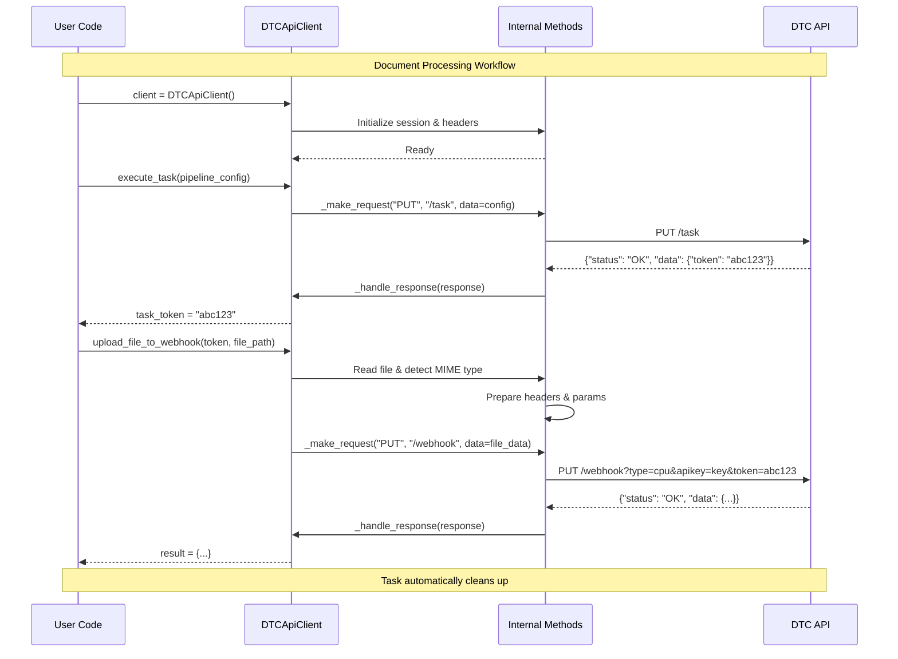
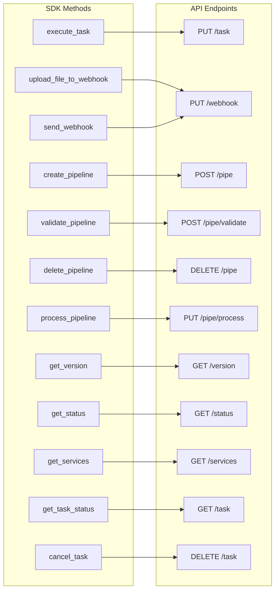
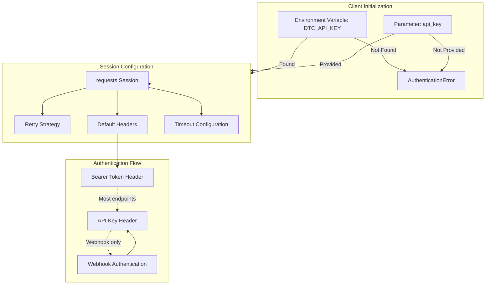
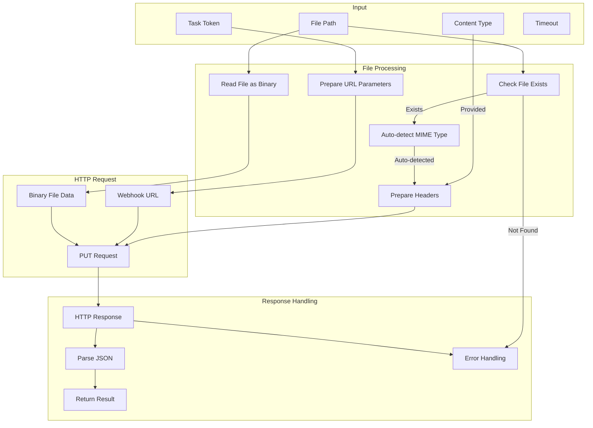

# DTC API SDK Architecture

This document provides a technical overview of the DTC API SDK architecture, internal components, and data flow.

## SDK Architecture Overview

```mermaid
graph TB
    %% User Code
    subgraph UserCode ["User Application"]
        APP[Python Application]
        IMPORT[from dtc_api_sdk.client import DTCApiClient]
        CLIENT_INIT[client = DTCApiClient()]
    end
    
    %% SDK Core
    subgraph SDKCore ["DTC API SDK Core"]
        DTCCLIENT[DTCApiClient]
        MODELS[Data Models]
        EXCEPTIONS[Exception Classes]
        
        %% Client Methods
        subgraph ClientMethods ["Client Methods"]
            EXECUTE[execute_task]
            UPLOAD[upload_file_to_webhook]
            CREATE[create_pipeline]
            VALIDATE[validate_pipeline]
            DELETE[delete_pipeline]
            PROCESS[process_pipeline]
            VERSION[get_version]
            STATUS[get_status]
            SERVICES[get_services]
        end
        
        %% Internal Components
        subgraph Internal ["Internal Components"]
            MAKE_REQ[_make_request]
            HANDLE_RESP[_handle_response]
            SESSION[requests.Session]
            RETRY[Retry Strategy]
        end
    end
    
    %% API Layer
    subgraph APILayer ["DTC API Endpoints"]
        TASK_EP[/task]
        WEBHOOK_EP[/webhook]
        PIPE_EP[/pipe]
        VALIDATE_EP[/pipe/validate]
        PROCESS_EP[/pipe/process]
        VERSION_EP[/version]
        STATUS_EP[/status]
        SERVICES_EP[/services]
    end
    
    %% Connections
    APP --> IMPORT
    IMPORT --> CLIENT_INIT
    CLIENT_INIT --> DTCCLIENT
    
    DTCCLIENT --> ClientMethods
    ClientMethods --> Internal
    
    EXECUTE --> MAKE_REQ
    UPLOAD --> MAKE_REQ
    CREATE --> MAKE_REQ
    VALIDATE --> MAKE_REQ
    DELETE --> MAKE_REQ
    PROCESS --> MAKE_REQ
    VERSION --> MAKE_REQ
    STATUS --> MAKE_REQ
    SERVICES --> MAKE_REQ
    
    MAKE_REQ --> SESSION
    SESSION --> RETRY
    
    MAKE_REQ --> HANDLE_RESP
    HANDLE_RESP --> MODELS
    HANDLE_RESP --> EXCEPTIONS
    
    %% API Connections
    MAKE_REQ --> TASK_EP
    MAKE_REQ --> WEBHOOK_EP
    MAKE_REQ --> PIPE_EP
    MAKE_REQ --> VALIDATE_EP
    MAKE_REQ --> PROCESS_EP
    MAKE_REQ --> VERSION_EP
    MAKE_REQ --> STATUS_EP
    MAKE_REQ --> SERVICES_EP
```

## Document Processing Flow



## Method-to-Endpoint Mapping



## Error Handling Flow

```mermaid
graph TB
    %% Request Flow
    REQUEST[API Request]
    RESPONSE[API Response]
    
    %% Response Handling
    subgraph ResponseHandling ["Response Handling"]
        PARSE[Parse JSON]
        STATUS_CHECK[Check Status Code]
        RESPONSE_STATUS[Check Response Status]
    end
    
    %% Success Path
    subgraph SuccessPath ["Success Path"]
        API_RESPONSE[APIResponse Object]
        RETURN_DATA[Return Data to User]
    end
    
    %% Error Path
    subgraph ErrorPath ["Error Handling"]
        HTTP_ERROR[HTTP Error]
        AUTH_ERROR[Authentication Error]
        VALIDATION_ERROR[Validation Error]
        NETWORK_ERROR[Network Error]
        DTC_ERROR[DTC API Error]
    end
    
    %% Flow
    REQUEST --> RESPONSE
    RESPONSE --> ResponseHandling
    
    PARSE --> STATUS_CHECK
    STATUS_CHECK --> RESPONSE_STATUS
    
    %% Success
    RESPONSE_STATUS -->|status: "OK"| API_RESPONSE
    API_RESPONSE --> RETURN_DATA
    
    %% Errors
    STATUS_CHECK -->|401| AUTH_ERROR
    STATUS_CHECK -->|422| VALIDATION_ERROR
    STATUS_CHECK -->|4xx/5xx| HTTP_ERROR
    PARSE -->|Connection Error| NETWORK_ERROR
    RESPONSE_STATUS -->|status: "Error"| DTC_ERROR
```

## Data Models Structure

```mermaid
graph TB
    %% Base Models
    subgraph BaseModels ["Base Data Models"]
        RESPONSE_STATUS[ResponseStatus]
        API_RESPONSE[APIResponse]
    end
    
    %% Specific Models
    subgraph SpecificModels ["Specific Models"]
        PIPELINE_CONFIG[PipelineConfig]
        PIPELINE_INFO[PipelineInfo]
        TASK_INFO[TaskInfo]
        SERVICE_INFO[ServiceInfo]
        TASK_STATUS[TaskStatus]
    end
    
    %% Response Structure
    subgraph ResponseStructure ["Response Structure"]
        STATUS[status: "OK" | "Error"]
        DATA[data: Any]
        ERROR[error: Dict]
        METRICS[metrics: Dict]
    end
    
    %% Relationships
    API_RESPONSE --> ResponseStructure
    RESPONSE_STATUS --> STATUS
    
    PIPELINE_CONFIG --> DATA
    PIPELINE_INFO --> DATA
    TASK_INFO --> DATA
    SERVICE_INFO --> DATA
    TASK_STATUS --> DATA
```

## Authentication & Session Management



## File Upload Process



## Key Components

### DTCApiClient
- **Purpose**: Main entry point for all API operations
- **Configuration**: API key, base URL, timeout, retry strategy
- **Methods**: High-level methods for document processing

### Internal Request Handler
- **`_make_request()`**: Handles all HTTP requests with retry logic
- **`_handle_response()`**: Processes responses and handles errors
- **Session Management**: Persistent connection pooling

### Data Models
- **APIResponse**: Standardized response format
- **Configuration Models**: Pipeline, task, and service configurations
- **Exception Classes**: Specific error types for different failure modes

### Error Handling
- **Network Errors**: Connection timeouts, SSL errors
- **Authentication Errors**: Invalid API keys
- **Validation Errors**: Invalid pipeline configurations
- **API Errors**: Server-side processing errors

## Usage Patterns

### Task-based Processing (Recommended)
```python
# Create task → Upload file → Automatic cleanup
task_token = client.execute_task(pipeline_config)
result = client.upload_file_to_webhook(task_token, file_path)
```

### Pipeline-based Processing
```python
# Create pipeline → Process multiple files → Manual cleanup
pipeline_token = client.create_pipeline(pipeline_config)
result = client.process_pipeline(pipeline_token, file_path)
client.delete_pipeline(pipeline_token)
```

### System Information
```python
# Get system health and service information
version = client.get_version()
status = client.get_status()
services = client.get_services()
```

---

This architecture provides a clean, Pythonic interface to the DTC API while handling the complexity of HTTP requests, authentication, error handling, and data processing internally. 