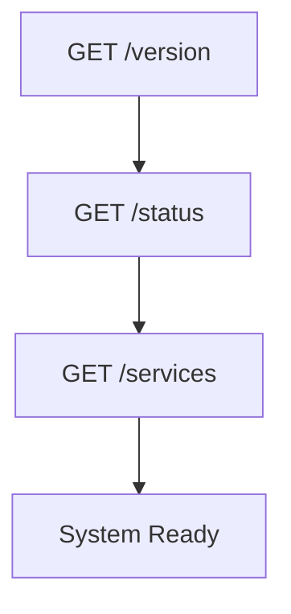
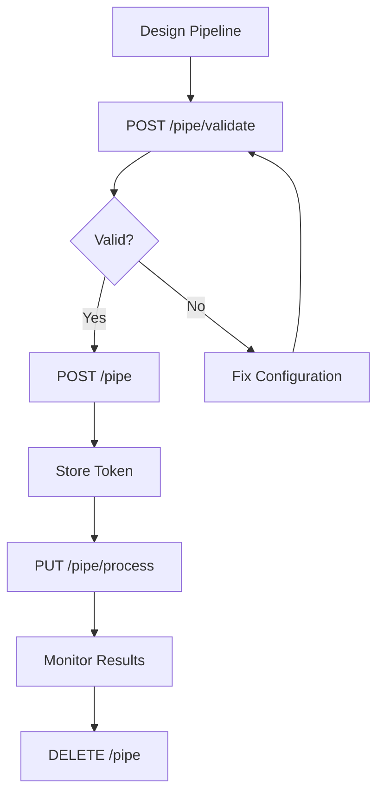
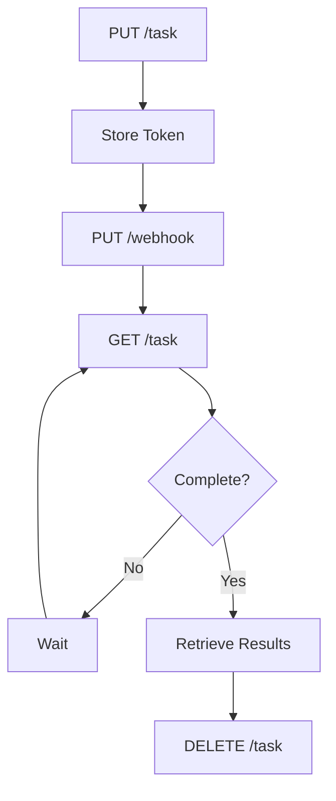
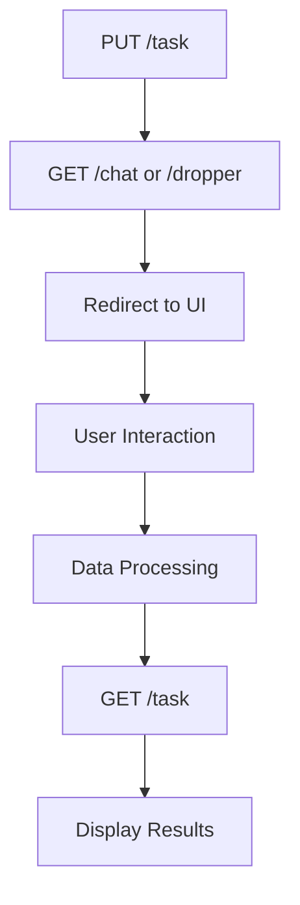
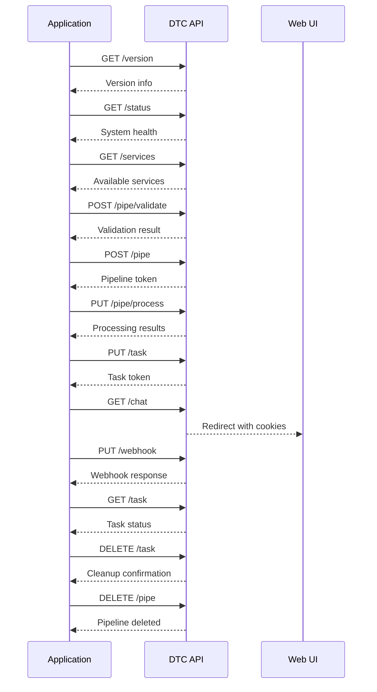

# Aparavi Data Toolchain API Documentation

Complete reference for the Aparavi Data Toolchain (DTC) API endpoints with detailed usage sequences and examples.

## 📋 Table of Contents

1. [Overview](#overview)
2. [Authentication](#authentication)
3. [System Health Endpoints](#system-health-endpoints)
4. [Pipeline Management](#pipeline-management)
5. [Task Management](#task-management)
6. [User Interface Endpoints](#user-interface-endpoints)
7. [Usage Sequences](#usage-sequences)
8. [Error Handling](#error-handling)
9. [Response Formats](#response-formats)

---

## Overview

The Aparavi Data Toolchain API provides endpoints for managing document processing pipelines, executing tasks, and interacting with various data processing components. The API follows REST principles and uses JSON for data exchange.

**Base URL**: `https://eaas-dev.aparavi.com`  
**Authentication**: Bearer token in Authorization header  
**Content-Type**: `application/json` (except for file uploads)

---

## Authentication

All API endpoints require authentication via Bearer token:

```http
Authorization: Bearer YOUR_API_KEY
```

---

## System Health Endpoints

### 1. GET `/version`
**Purpose**: Retrieve API version information

**Request**:
```http
GET /version
Authorization: Bearer YOUR_API_KEY
```

**Response**:
```json
{
  "status": "OK",
  "data": {
    "version": "3.0.0.9999",
    "hash": "52a8d5f",
    "stamp": "07/15/25 22:25:22"
  }
}
```

**Use Case**: Health checks, version verification, deployment validation

---

### 2. GET `/status`
**Purpose**: Check server status and system health

**Request**:
```http
GET /status
Authorization: Bearer YOUR_API_KEY
```

**Response**:
```json
{
  "status": "OK",
  "data": {
    "uptime": "2 days, 14 hours",
    "pipes": 5,
    "tasks": 12,
    "memory_usage": "45%",
    "cpu_usage": "23%"
  }
}
```

**Use Case**: System monitoring, performance tracking, operational dashboards

---

### 3. GET `/services`
**Purpose**: List available services and their status

**Request**:
```http
GET /services
Authorization: Bearer YOUR_API_KEY
```

**Optional Parameters**:
- `service` (string): Filter by specific service name

**Response**:
```json
{
  "status": "OK",
  "data": [
    {
      "name": "webhook",
      "status": "active",
      "version": "2.1.0",
      "description": "Webhook data processing service",
      "endpoints": ["/webhook"]
    },
    {
      "name": "parse",
      "status": "active", 
      "version": "1.5.2",
      "description": "Document parsing service",
      "endpoints": ["/parse"]
    }
  ]
}
```

**Use Case**: Service discovery, dependency checking, system architecture visualization

---

## Pipeline Management

### 4. POST `/pipe/validate`
**Purpose**: Validate pipeline configuration without creating it

**Request**:
```http
POST /pipe/validate
Authorization: Bearer YOUR_API_KEY
Content-Type: application/json

{
  "pipeline": {
    "source": "webhook_1",
    "components": [
      {
        "id": "webhook_1",
        "provider": "webhook",
        "config": {
          "mode": "Source",
          "type": "webhook"
        }
      },
      {
        "id": "response_1",
        "provider": "response",
        "config": {
          "lanes": []
        },
        "input": [
          {
            "lane": "text",
            "from": "webhook_1"
          }
        ]
      }
    ],
    "id": "validation_test"
  }
}
```

**Response**:
```json
{
  "status": "OK",
  "data": {
    "valid": true,
    "components": [...],
    "errors": [],
    "warnings": []
  }
}
```

**Use Case**: Configuration validation, pre-deployment checks, development testing

---

### 5. POST `/pipe`
**Purpose**: Create a new processing pipeline

**Request**:
```http
POST /pipe?name=my_pipeline
Authorization: Bearer YOUR_API_KEY
Content-Type: application/json

{
  "pipeline": {
    "source": "webhook_1",
    "components": [
      {
        "id": "webhook_1",
        "provider": "webhook",
        "config": {
          "mode": "Source",
          "type": "webhook"
        }
      },
      {
        "id": "parse_1",
        "provider": "parse",
        "config": {},
        "input": [
          {
            "lane": "tags",
            "from": "webhook_1"
          }
        ]
      },
      {
        "id": "response_1",
        "provider": "response",
        "config": {
          "lanes": []
        },
        "input": [
          {
            "lane": "text",
            "from": "parse_1"
          }
        ]
      }
    ],
    "id": "document_processing_pipeline"
  }
}
```

**Query Parameters**:
- `name` (string, optional): Pipeline name for identification

**Response**:
```json
{
  "status": "OK",
  "data": {
    "token": "abc123def456",
    "name": "my_pipeline",
    "created_at": "2025-01-15T10:30:00Z"
  }
}
```

**Use Case**: Pipeline deployment, workflow automation, data processing setup

---

### 6. DELETE `/pipe`
**Purpose**: Delete an existing pipeline

**Request**:
```http
DELETE /pipe?token=abc123def456
Authorization: Bearer YOUR_API_KEY
```

**Query Parameters**:
- `token` (string, required): Pipeline token from creation

**Response**:
```json
{
  "status": "OK"
}
```

**Use Case**: Resource cleanup, pipeline lifecycle management, deployment rollback

---

### 7. PUT `/pipe/process`
**Purpose**: Upload files to process through a pipeline

**Request**:
```http
PUT /pipe/process?token=abc123def456
Authorization: Bearer YOUR_API_KEY
Content-Type: multipart/form-data

[FILE DATA]
```

**Query Parameters**:
- `token` (string, required): Pipeline token

**Content**: Multipart form data with file uploads

**Response**:
```json
{
  "status": "OK",
  "data": {
    "objectsRequested": 1,
    "objectsCompleted": 1,
    "types": {
      "pdf": 1
    },
    "objects": {
      "document_1": {
        "status": "processed",
        "text": "Extracted text content...",
        "metadata": {...}
      }
    }
  },
  "metrics": {
    "cpu": 2.5,
    "output": 1024,
    "total_time": 3.2,
    "requests": 1
  }
}
```

**Use Case**: Document processing, file analysis, content extraction

---

## Task Management

### 8. PUT `/task`
**Purpose**: Execute a task with pipeline configuration

**Request**:
```http
PUT /task?name=document_analysis&threads=4
Authorization: Bearer YOUR_API_KEY
Content-Type: application/json

{
  "pipeline": {
    "source": "webhook_1",
    "components": [
      {
        "id": "webhook_1",
        "provider": "webhook",
        "config": {
          "mode": "Source",
          "type": "webhook"
        }
      },
      {
        "id": "parse_1",
        "provider": "parse",
        "config": {},
        "input": [
          {
            "lane": "tags",
            "from": "webhook_1"
          }
        ]
      },
      {
        "id": "response_1",
        "provider": "response",
        "config": {
          "lanes": []
        },
        "input": [
          {
            "lane": "text",
            "from": "parse_1"
          }
        ]
      }
    ],
    "id": "task_pipeline"
  }
}
```

**Query Parameters**:
- `name` (string, optional): Task name for identification
- `threads` (integer, optional): Number of threads (1-16)

**Response**:
```json
{
  "status": "OK",
  "data": {
    "token": "task_xyz789",
    "type": "cpu",
    "name": "document_analysis",
    "threads": 4
  },
  "metrics": {
    "cpu": 2.64,
    "output": 84,
    "total_time": 2.646,
    "requests": 1
  }
}
```

**Use Case**: Batch processing, long-running operations, background tasks

---

### 9. GET `/task`
**Purpose**: Get task status and progress

**Request**:
```http
GET /task?token=task_xyz789
Authorization: Bearer YOUR_API_KEY
```

**Query Parameters**:
- `token` (string, required): Task token from execution

**Response**:
```json
{
  "status": "OK",
  "data": {
    "completed": false,
    "startTime": 1752629680.0802376,
    "endTime": 0,
    "status": "running",
    "warnings": [],
    "errors": [],
    "currentObject": "document_5.pdf",
    "currentSize": 1024,
    "totalSize": 10240,
    "totalCount": 10,
    "completedSize": 5120,
    "completedCount": 5,
    "failedSize": 0,
    "failedCount": 0,
    "wordsSize": 2048,
    "wordsCount": 500,
    "rateSize": 512,
    "rateCount": 1,
    "serviceUp": true,
    "exitCode": 0,
    "exitMsg": "",
    "trace": [
      "[39MB] Main arguments",
      "[40MB] Processing document_5.pdf"
    ]
  }
}
```

**Use Case**: Progress monitoring, status tracking, debugging

---

### 10. DELETE `/task`
**Purpose**: Cancel a running task

**Request**:
```http
DELETE /task?token=task_xyz789
Authorization: Bearer YOUR_API_KEY
```

**Query Parameters**:
- `token` (string, required): Task token

**Response**:
```json
{
  "status": "OK",
  "data": {
    "cancelled": true,
    "token": "task_xyz789"
  }
}
```

**Use Case**: Task cancellation, resource management, error recovery

---

## User Interface Endpoints

### 11. PUT `/webhook`
**Purpose**: Send data to a task via webhook

**Request**:
```http
PUT /webhook?token=task_xyz789
Authorization: Bearer YOUR_API_KEY
Content-Type: application/json

{
  "message": "Process this document",
  "data": {
    "document_id": "doc_123",
    "priority": "high"
  }
}
```

**Query Parameters**:
- `token` (string, required): Task token

**Response**:
```json
{
  "status": "OK",
  "data": {
    "processed": true,
    "result": "Document queued for processing",
    "queue_position": 1
  }
}
```

**Use Case**: Real-time data ingestion, external system integration, event-driven processing

---

### 12. GET `/chat`
**Purpose**: Initialize chat interface with session cookies

**Request**:
```http
GET /chat?type=conversation&token=task_xyz789&apikey=YOUR_API_KEY
```

**Query Parameters**:
- `type` (string, required): Chat type (conversation, assistant, etc.)
- `token` (string, required): Task token
- `apikey` (string, required): API key for session

**Response**: 
```http
HTTP/1.1 302 Found
Location: /chat/pages
Set-Cookie: type=conversation; Path=/
Set-Cookie: token=task_xyz789; Path=/
Set-Cookie: apikey=YOUR_API_KEY; Path=/
```

**Use Case**: Interactive chat interfaces, user sessions, web UI integration

---

### 13. GET `/dropper`
**Purpose**: Initialize file dropper interface

**Request**:
```http
GET /dropper?type=file_upload&token=task_xyz789&apikey=YOUR_API_KEY
```

**Query Parameters**:
- `type` (string, required): Dropper type (file_upload, document_drop, etc.)
- `token` (string, required): Task token
- `apikey` (string, required): API key for session

**Response**:
```http
HTTP/1.1 302 Found
Location: /dropper/pages
Set-Cookie: type=file_upload; Path=/
Set-Cookie: token=task_xyz789; Path=/
Set-Cookie: apikey=YOUR_API_KEY; Path=/
```

**Use Case**: File upload interfaces, drag-and-drop functionality, web UI integration

---

## Usage Sequences

### 🔄 Common Workflow Patterns

#### 1. **Health Check Sequence**


**Steps**:
1. Check API version compatibility
2. Verify system health and resources
3. Confirm required services are available
4. Proceed with main operations

#### 2. **Pipeline Development Sequence**


**Steps**:
1. Design pipeline configuration
2. Validate configuration with `/pipe/validate`
3. Fix any validation errors
4. Create pipeline with `/pipe`
5. Store returned token for future use
6. Process files with `/pipe/process`
7. Monitor processing results
8. Clean up pipeline with `/pipe` DELETE

#### 3. **Task-Based Processing Sequence**


**Steps**:
1. Execute task with `/task`
2. Store task token
3. Send data via `/webhook`
4. Poll status with `/task` GET
5. Wait if not complete
6. Retrieve final results
7. Cancel/cleanup with `/task` DELETE

#### 4. **Interactive UI Sequence**


**Steps**:
1. Create task for UI interaction
2. Initialize UI with `/chat` or `/dropper`
3. User redirected to web interface
4. User interacts with interface
5. Data processed in background
6. Monitor progress with `/task` GET
7. Display results to user

### 🎯 **Best Practices Sequence**

#### Complete Application Flow


---

## Error Handling

### Standard Error Response Format
```json
{
  "status": "Error",
  "error": {
    "message": "Detailed error description",
    "code": "ERROR_CODE",
    "details": {
      "field": "specific_field",
      "reason": "validation_failed"
    }
  }
}
```

### Common Error Scenarios

#### Authentication Errors (401)
```json
{
  "status": "Error",
  "error": {
    "message": "Invalid authorization header",
    "code": "AUTH_INVALID"
  }
}
```

#### Validation Errors (422)
```json
{
  "status": "Error",
  "error": {
    "message": "'pipeline.source' must be a string",
    "code": "VALIDATION_ERROR"
  }
}
```

#### Resource Not Found (404)
```json
{
  "status": "Error",
  "error": {
    "message": "Pipe with key abc123def456 not found",
    "code": "RESOURCE_NOT_FOUND"
  }
}
```

---

## Response Formats

### Success Response Structure
```json
{
  "status": "OK",
  "data": {
    // Response-specific data
  },
  "metrics": {
    "cpu": 2.5,
    "output": 1024,
    "total_time": 3.2,
    "requests": 1
  }
}
```

### Error Response Structure
```json
{
  "status": "Error",
  "error": {
    "message": "Error description",
    "code": "ERROR_CODE",
    "details": {}
  }
}
```

### Status Values
- `"OK"`: Request successful
- `"Error"`: Request failed

---

## 📚 Additional Resources

- **OpenAPI Specification**: `openapi.json` - Complete API specification
- **Unit Tests**: `unit_tests/` - Comprehensive test suite with examples
- **SDK Documentation**: `docs/` - Python SDK usage guide
- **Examples**: `examples/` - Working code examples

---

## 🔧 Development Tips

1. **Always validate** pipeline configurations before creation
2. **Store tokens securely** for resource cleanup
3. **Monitor task status** for long-running operations
4. **Handle errors gracefully** with appropriate retry logic
5. **Clean up resources** to prevent accumulation
6. **Use appropriate threading** for optimal performance
7. **Check service availability** before making requests

---

*Last Updated: January 15, 2025*  
*API Version: 3.0.0.9999* 